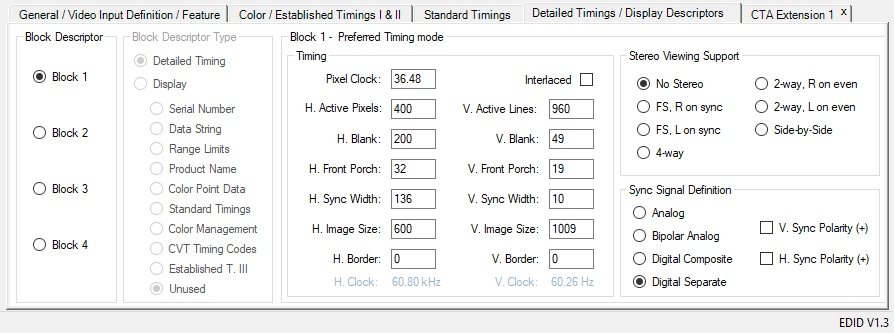

# EDID Data

This folder contains the EDID data for the display used in this project.
However, the current bit file is already synthesized with the correct EDID data, so this shouldn't be necessary unless you intend to use a different display or modify the timings.

## Table of contents
- [Replacing the EDID Data](#replacing-the-edid-data)
- [Timing Data](#timing-data)
- [Generating or Modifying EDID Data](#generating-or-modifying-edid-data)
- [Modeline to EDID](#modeline-to-edid)

## Replacing the EDID Data

To replace the EDID data, you need to identify all the files named "dgl_720p_cea.data" in the project. I am unsure if you only need to replace the one that Vivado copied into the project folder, or the one in the IP core as well. I simply replaced both.
These files are typically found in both the [fpga folder](../fpga/xilinx/xilinx.srcs/sources_1/ip/dvi2rgb_0/src/dgl_720p_cea.data) and the [IP core folder](../vivado-library/ip/dvi2rgb/src/dgl_720p_cea.data).

This however should be done manually, as the IP core is a submodule and cannot be published.

## Timing Data

The Timing data needed for this project was specified in the datasheet for the display, however I found that to be insufficient and unreliable on most systems. This was due to the clock being too slow, and not enough time being given to the display to process the data. Luckily, the display does not have any upper limits to how much "trash" data it can receive for synchronezation.
This tool generates a modeline for the display, which we can convert to EDID data using the [Free86 modeline generator](https://xtiming.sourceforge.net/cgi-bin/xtiming.pl) made by Ethan Fischer, comes in.
The beauty of this, is that its designed for CRT monitors in mind, which have a problematic resolution when it comes to modern interfaces.

## Generating or Modifying EDID Data

The binary file is generated using the [Deltacast EDID Editor](https://www.deltacast.tv/products/free-software/e-edid-editor). It is a "free" tool, but requires registration. This outputs a pure binary file, which in itself is not very useful. So I wrote a simple python script to convert it to the data file used by the Digilent IP powering the HDMI interface. This script is included [here](edid_to_ip.py).

## Modeline to EDID

Converting the modeline data generated by the site to usable EDID data, you have to do some basic arithmetic.
Taking the following modeline data as used by the display as an example:
```
Modeline "400x960@60" 36.48 400 432 568 600 960 979 989 1009
```

This is the data that is generated by the site. We can extract the following information from it:
```
Pixel Clock:     36.48 MHz

H. Display:     400
H. Sync Start:  432
H. Sync End:    568
H. Total:       600

V. Display:     960
V. Sync Start:  979
V. Sync End:    989
V. Total:       1009
```

These values are not immediately obvious how they fit into the EDID more strict format. Luckily its rather easy to convert them.
The front porch can be found by simply:
```
Front Porch = Sync Start - Display
```

The sync width can be found by:
```
Sync Width = Sync End - Sync Start
```

The blanking time can be found by:
```
Blanking = Front Porch + Sync Width + Back Porch
```
However, as the back porch is not given, we can simply infer it by taking the total pixel count and subtracting the screen size:
```
Back Porch = Total - Display
```

This should give us the following values:
```
Pixel Clock:     36.48 MHz

H. Active:      400
H. Blank:       200
H. Front Porch:  32
H. Sync Width:  136
H. Image Size:  600

V. Active:      960
V. Blank:        49
V. Front Porch:  19
V. Sync Width:   10
V. Image Size:  1009
```

These are simply plotted into the Detailed Timings / Display Descriptor section of the EDID editor.
Important to note that you also need to set the "Sync Signal Definition" to "Digital Seperate" and both the sync signals should be unchecked.

Your "Detailed Timings / Display Descriptor" section should look like this:

