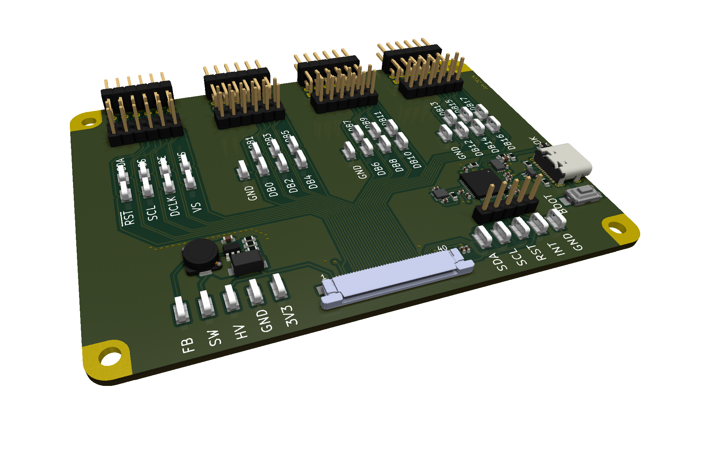

# Breakout Board

This repo contains the KiCAD files for the first itteration of this project, the breakout board.

## Known Issues

These are the known issues with the current design:
- No pull-up resistors on the I2C lines
- No reset button
- No ability to power the board from the USB port (for the microcontroller)
- Difficult to add external power to the board