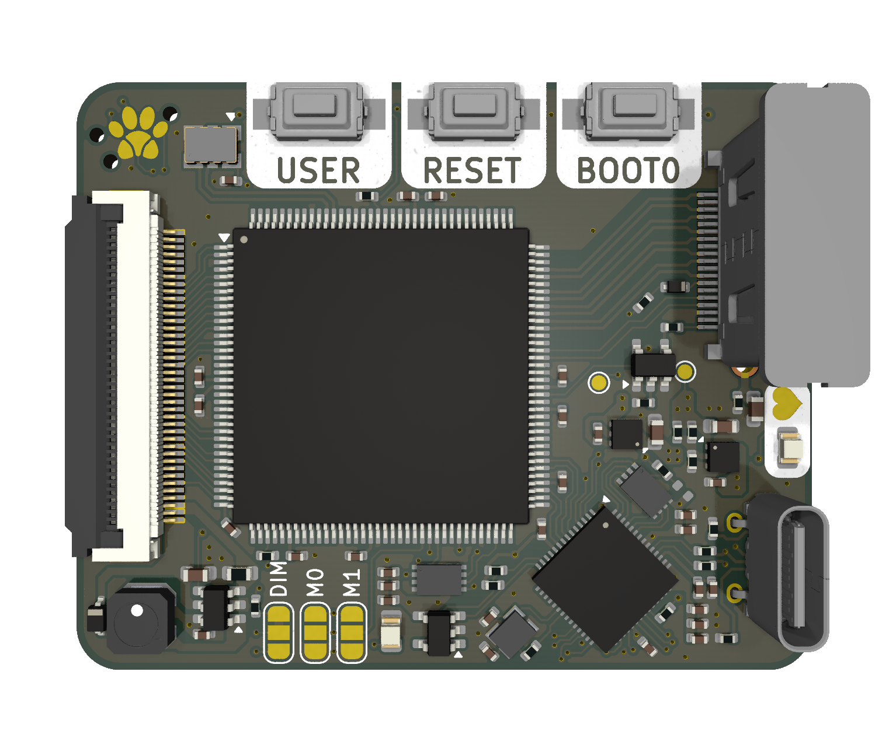

# Integrated Solution Rev 1.1

## Introduction

Even smaller than the previous revision, this design is a complete redesign of the previous, and implements fixes for the critical errors in the previous design. This design is still in the prototype phase and is not ready for production.

This is a PCB that integrates everything needed to drive the display. It is designed to sit on the back of the display without interfering with the display frame. It is specifically designed for the pinout of the newer non-standard displays that have come out of China in the recent years. Specifically those that support the RGB666 interface.

This design utilizes a Spartan 6 FPGA to drive the display. This was chosen over dedicated ASICs due to cost and adaptability. This should allow me to add features such as a splash screen or other custom features that are not possible with a dedicated ASIC.

## Features
- Spartan 6 FPGA [^1]
- DVI Input [^2]
- RP2040 microcontroller
- USB-C [^3] [^4]
- Backlight driver with dimming control
- LCD connector

[^1]: XC6SLX9-TQG144
[^2]: The DVI input is over a HDMI-like connector. This is due to licensing issues with the HDMI standard that I cannot afford to pay for. Any reference to HDMI in this project is purely for the sake of simplicity and is not meant to imply that this project is HDMI compatible.
[^3]: Does not support PD.
[^4]: Limited to USB 1.1 speeds. This is limited by the RP2040 which handles the USB interface.