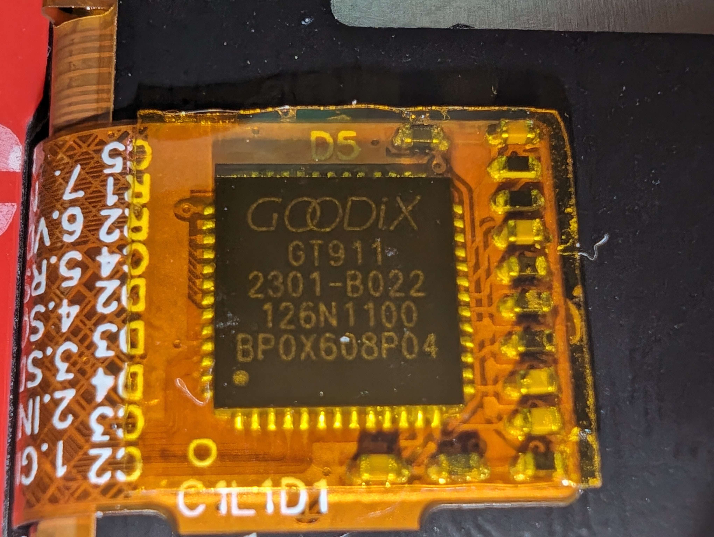

# Firmware

The firmware is written in C/C++ and is designed to work on the RP2040 microcontroller.
Its job is to read the data from the capacitive touch sensor, and send it to the host computer over USB.

The difficult part here is the fact that the capacitive touch sensor is an unknown device.
But we are extremely lucky that the display's touch controller is soldered on the flat flex cable, and they did not remove its markings.
The touch controller is a GT911 from Goodix, and it uses the I2C protocol.

## Resources
[Datasheet](resources/GT911_v.09.pdf)
[Programming Guide](resources/GT911%20Programming%20Guide_v0.1.pdf) (contains register map)